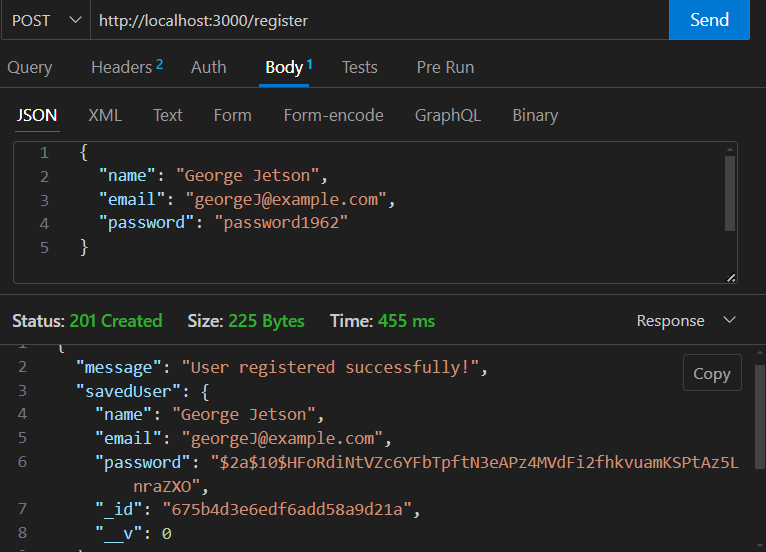
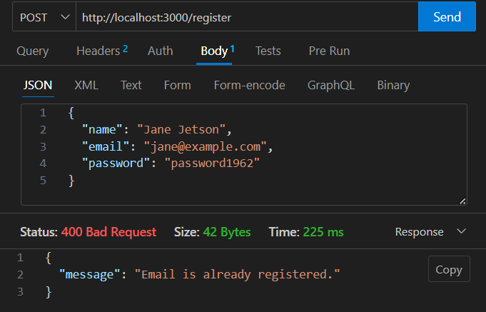
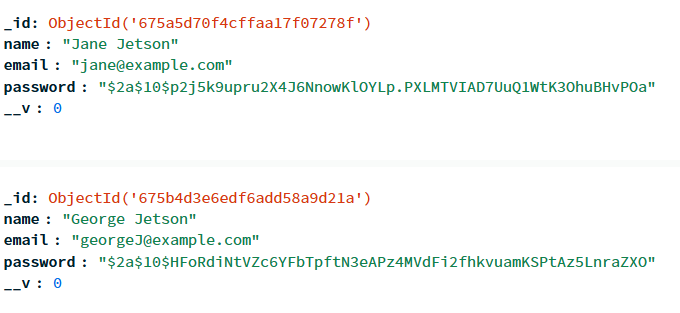

# Express MongoDB Authentication Project

## Project Objective/Overview

This project demonstrates how to build a basic authentication system using Express and MongoDB. The key focus is on understanding user password security through hashing. Users can register with their name, email, and password, which are securely stored in a MongoDB database. The project covers the following:

- Setting up an Express server connected to MongoDB.
- Defining a User schema with password hashing using bcrypt.
- Implementing a registration endpoint (`POST /register`).
- Testing the registration endpoint and verifying data in the MongoDB database.

## Setting Up the Project

1. **Create a Repository**:

   - Initialized a repository with a `README.md` and `.gitignore` (set to Node.js).
   - Cloned the repository locally.

2. **Initialize the Project**:

   ```bash
   npm init -y
   ```

   - Installed dependencies:
     ```bash
     npm install express mongoose bcryptjs dotenv
     ```

3. **Environment Setup**:
   - Created a `.env` file to store the MongoDB connection URL:
     ```env
     MONGO_URL=your_mongo_db_connection_string
     ```

## Creating a Basic Express Server with MongoDB Connection

- The `index.js` file sets up the Express server and connects it to MongoDB using Mongoose.
- The server listens on port `3000` and includes middleware to parse JSON bodies.

### Code:

```javascript
const express = require("express");
const mongoose = require("mongoose");
const User = require("./models/users");
const app = express();
const port = 3000;

require("dotenv").config();
const mongoUrl = process.env.MONGO_URL;

// Middleware to parse JSON bodies
app.use(express.json());

// Connect to MongoDB
mongoose
  .connect(mongoUrl, {
    useNewUrlParser: true,
    useUnifiedTopology: true,
  })
  .then(() => {
    console.log("Connected to MongoDB");
  })
  .catch((error) => {
    console.error("Error connecting to MongoDB:", error);
  });

app.get("/", (req, res) => {
  res.send("Hello, World!");
});

app.listen(port, () => {
  console.log(`Server is running at http://localhost:${port}`);
});
```

## Defining the User Schema with Password Hashing

- The `models/users.js` file defines the user schema with fields for name, email, and password.
- Passwords are hashed using bcrypt before saving to ensure security.

### Code:

```javascript
const mongoose = require("mongoose");
const bcrypt = require("bcryptjs");

const userSchema = mongoose.Schema({
  name: { type: String },
  email: { type: String, unique: true },
  password: { type: String },
});

userSchema.pre("save", async function (next) {
  const salt = await bcrypt.genSalt(10);
  const plainTextPassword = this.password;
  const encryptedPassword = await bcrypt.hash(plainTextPassword, salt);
  this.password = encryptedPassword;
  next();
});

const User = mongoose.model("User", userSchema);

module.exports = User;
```

## Implementing a Registration Endpoint with Hashed Passwords

- The `/register` route accepts a `POST` request with the user's details and saves the user with a hashed password in the database.

### Code:

```javascript
app.post("/register", async (req, res) => {
  const { name, email, password } = req.body;

  if (!name || !email || !password) {
    return res.status(400).json({ message: "All fields are required." });
  }

  const existingUser = await User.findOne({ email });
  if (existingUser) {
    return res.status(400).json({ message: "Email is already registered." });
  }

  const newUser = new User({
    name,
    email,
    password,
  });

  try {
    const savedUser = await newUser.save();
    res
      .status(201)
      .json({ message: "User registered successfully!", savedUser });
  } catch (err) {
    console.error(err);
    res.status(500).json({ message: "Server error" });
  }
});
```

## Testing Registration

1. **Start the Server**:

   ```bash
   node index.js
   ```

2. **Use Thunder Client or Postman**:

   - Test the `POST /register` endpoint with the following JSON body:
     ```json
     {
       "name": "Jane Doe",
       "email": "jane@example.com",
       "password": "password123"
     }
     ```
   - Verify:

     - Success message on successful registration.

       

     - Error message if the email already exists.

       

3. **Check MongoDB**:

   - Connect to the database and verify that the `password` field is hashed.

     

## What I Learned

### **bcrypt**:

- **What it does**: A library for hashing passwords to enhance security.
- **Why use it**: Hashed passwords prevent storing plain-text passwords, protecting user data even if the database is compromised.
- **How it works**:
  - **Salt**: Adds randomness to the hashing process, ensuring identical passwords have unique hashes.
  - **Hashing**: Converts passwords into irreversible hashed values.

### **Use Cases**:

- Storing user passwords securely.
- Creating tokens for password reset mechanisms.

### **Example**:

```javascript
const bcrypt = require("bcryptjs");

async function hashPassword(password) {
  const salt = await bcrypt.genSalt(10);
  return await bcrypt.hash(password, salt);
}

async function verifyPassword(inputPassword, storedHash) {
  return await bcrypt.compare(inputPassword, storedHash);
}
```

- **verifyPassword**: This function compares the user's input password with the stored hashed password in the database. If they match, authentication is successful.

This project taught me the importance of securing user data and how to implement foundational authentication features with bcrypt.
